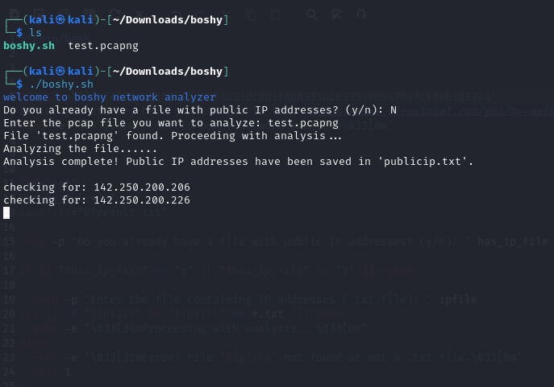
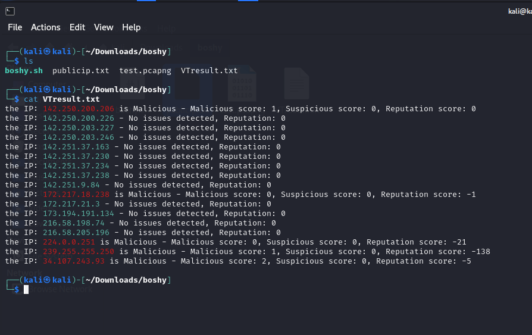

# Boshy IP Analyzer

Boshy IP Analyzer is a powerful Bash-based tool designed for analyzing IP addresses extracted from `.txt` or `.pcap` files. This tool identifies public IP addresses, filters private IPs based on user preferences, and checks the remaining IPs for malicious activity using VirusTotal.

## Features

- **File Input Options:** Analyze `.txt` files or network capture files (`.pcap`).
- **Public IP Filtering:** Automatically extracts public IPs and filters out private addresses.
- **VirusTotal Integration:** Checks IP addresses for malicious activity using your VirusTotal API key.
- **Customizable Output:** Results are saved to a file for further review.

## Prerequisites

- **Operating System:** Linux or any Bash-compatible environment.
- **Dependencies:**
  - `tshark`: For processing `.pcap` files.
  - `curl`: For sending API requests to VirusTotal.
- **VirusTotal API Key:** Obtain an API key from [VirusTotal](https://www.virustotal.com/gui/my-apikey).

## Installation

1. Clone the repository:
   ```bash
   git clone https://github.com/osamagmex/boshy.git

   cd boshy
   ```
2. Ensure the script is executable:
   ```bash
   chmod +x boshy.sh
   ```
3. Install required dependencies:
   ```bash
   sudo apt-get install tshark curl
   ```

## Usage

1. **Run the Script:**
   ```bash
   ./boshy.sh
   ```
2. **User Prompts:**
   - If you already have a `.txt` file with public IP addresses, provide the file path.
   - If analyzing a `.pcap` file, provide the file path when prompted. The tool extracts public IPs from the capture file.
3. **Results:**
   - Results are saved in `VTresult.txt` by default.

### Example

```bash
./boshy.sh
```

- Input a `.txt` file with public IPs or a `.pcap` file for analysis.
- The tool will extract public IPs, filter out private ones, and check VirusTotal for malicious activity.

## Output

- **Malicious IPs:** IPs flagged as malicious by VirusTotal, with scores provided.
- **Safe IPs:** IPs with no malicious or suspicious activity detected.
- **bi**Contributing

## Example Usage



after analyzing all the ip addresses:





## Contact

For questions or feedback, reach out via:

- GitHub: [osamagmex](https://github.com/osamagmex)
- Discord: osamagmex

